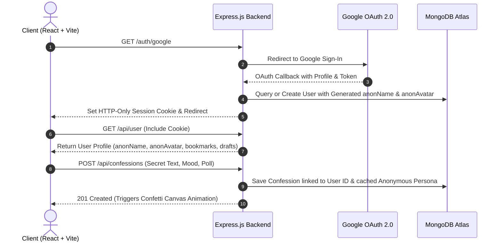

# 🕵️ ConfessHere - Anonymous Confession Platform

> **A modern, full-stack, identity-decoupled anonymous confession platform built with the MERN stack.**  
> Express secrets, send private direct messages, react with particle bursts, vote on polls, and share anonymously without compromising personal identity.

[](https://www.confesshere.online)
[](https://nodejs.org)
[](https://expressjs.com)
[](https://react.dev)
[](https://vitejs.dev)
[](https://www.mongodb.com)

---

## 📑 Table of Contents

- [✨ Key Highlights & Features](#-key-highlights--features)
- [🔒 Decoupled Privacy Architecture](#-decoupled-privacy-architecture)
- [🏗 System Architecture](#-system-architecture)
- [📂 Project Directory Structure](#-project-directory-structure)
- [🗄 Database Models & Schemas](#-database-models--schemas)
- [🔌 REST API Reference](#-rest-api-reference)
- [⚙️ Environment Variables](#️-environment-variables)
- [🚀 Quickstart & Setup Guide](#-quickstart--setup-guide)
- [🌐 Deployment & Production Setup](#-deployment--production-setup)
- [🎨 Design Philosophy & UI Restraint](#-design-philosophy--ui-restraint)
- [👨‍💻 Author & License](#-author--license)

---

## ✨ Key Highlights & Features

### 🔐 Google OAuth with Decoupled Anonymity
- **Zero Identity Leakage:** Users log in safely using Google OAuth 2.0. However, user Google IDs and emails are strictly omitted from public posts, API feeds, and database queries.
- **Server-Generated Personas:** Upon initial sign-up, the backend server assigns a unique anonymous username (e.g., *Mystic Panda 42*) and a procedurally seeded pixel-art avatar powered by DiceBear.
- **360° Identity Regeneration:** Users can spin and regenerate their anonymous identity anytime to reset their persona.

### 📩 NGL-Style Private Inbox & Recipient Replies
- **Custom Secret Links:** Every registered user receives a personal sharing link (`/?send=<USER_ID>`) allowing anyone (including guests) to send direct anonymous secrets.
- **Private Recipient Replies:** Recipients can read incoming secrets in their private inbox and post direct replies.
- **Public Feed Conversion:** Once a recipient replies to a private secret, the secret and its reply can optionally be published to the main community feed.
- **Profile Visit Analytics:** Tracks unique link visits (`visitCount`) to display engagement stats on the recipient's inbox dashboard.

### 🎨 Writing-First Centered Composer
- **Restrained Editorial UI:** Replaces aggressive SaaS card design with a centered, distraction-free composer designed specifically for writing.
- **Mood Tag Filtering:** Classify confessions into categories (`#NGL`, `#Relationship`, `#Study`, `#College`, `#Feelings`, `#Career`, `#Mental Health`, `#Personal Thoughts`, `#Family`, `#Friends`, `#Others`).
- **Interactive Embedded Polls:** Attach multi-option polls to confessions with real-time percentage progress indicators and single-vote protection per user.
- **Offline Drafts & Bookmarks:** Save draft confessions locally or bookmark community secrets for later viewing.

### 🎉 Micro-Animations & Dynamic Feedback
- **Confetti Particle Celebrations:** Triggers a canvas confetti particle explosion upon successfully posting a secret.
- **Floating Emoji Bursts:** Dynamic canvas particle burst animations when users react to confessions with emojis (❤️, 😂, 😢, 🔥, 😮).
- **Glassmorphism Toast System:** Real-time feedback alerts equipped with progress-bar countdown timers.
- **Live Unread Inbox Polling:** Background polling interval notifies users when new NGL-style messages arrive.

### 🌐 Dynamic Social Sharing & OpenGraph Preview Engine
- **Server-Rendered Dynamic Share Links:** Endpoint `/share/:id` dynamically injects OpenGraph (OG) and Twitter Card metadata tags into HTML responses before client redirect.
- **Deep-Linking Support:** Direct URLs load specific shared secrets at the top of the feed automatically (`/?share=<CONFESSION_ID>`).

---

## 🔒 Decoupled Privacy Architecture

```
[ User Logins via Google OAuth ]
              │
              ▼
    Passport.js Strategy
              │
              ├─► Store Email & Google ID in Private User Model (Server DB Only)
              │
              └─► Generate Server-Side Persona:
                    ├─► anonName   : "MysticPanda42"
                    └─► anonAvatar : "https://api.dicebear.com/7.x/pixel-art-neutral/svg?seed=..."
              │
              ▼
[ Public API & Post Endpoints ]
  - Exposed data contains ONLY anonName & anonAvatar.
  - Google ID & Email are stripped via Mongoose `.select('-googleId -email')`.
```

---

## 🏗 System Architecture



---

## 📂 Project Directory Structure

```
confessit/
├── client/                     # Frontend React + Vite Web Application
│   ├── public/                 # Static public assets, favicon, and icons
│   ├── src/
│   │   ├── components/         # UI Components & Modules
│   │   │   ├── CommentItem.jsx          # Nested comment tree item
│   │   │   ├── CommentSection.jsx       # Comment list & composer
│   │   │   ├── ConfessionCard.jsx       # Individual secret card component
│   │   │   ├── ConfessionForm.jsx       # Hero writing composer
│   │   │   ├── ConfessionList.jsx       # Main feed & view container
│   │   │   ├── Confetti.jsx             # Canvas confetti explosion particle component
│   │   │   ├── DeleteModal.jsx          # Confirmation modal dialog
│   │   │   ├── EditModal.jsx            # Confession edit dialog
│   │   │   ├── LandingPage.jsx          # Editorial product landing page
│   │   │   ├── Navbar.jsx               # Header navigation & search bar
│   │   │   ├── PublicProfile.jsx        # NGL secret messaging profile page
│   │   │   ├── Sidebar.jsx              # Navigation sidebar & persona panel
│   │   │   ├── Toast.jsx                # Glassmorphism notification toasts
│   │   │   └── TrendingBar.jsx          # Real-time trending secrets section
│   │   ├── hooks/
│   │   │   └── useConfessions.js        # Central state management & API hook
│   │   ├── App.jsx                      # App root container & router controller
│   │   ├── index.css                    # Design tokens, variables & glassmorphism
│   │   └── main.jsx                     # Vite entry point
│   ├── package.json            # Client dependencies & build scripts
│   └── vite.config.js          # Vite server & build configuration
│
└── server/                     # Backend Node.js + Express API
    ├── config/
    │   └── passport.js         # Google OAuth 2.0 & Passport Session Serializers
    ├── models/
    │   ├── User.js             # Mongoose User Schema (Identity & Bookmarks)
    │   ├── Confession.js       # Mongoose Confession Schema (Reactions & Polls)
    │   └── Comment.js          # Mongoose Comment Schema (Threaded replies)
    ├── .env.example            # Environment template file
    ├── package.json            # Backend dependencies & start scripts
    └── server.js               # Express application entry point, CORS & routes
```

---

## 🗄 Database Models & Schemas

### 1. User Schema (`server/models/User.js`)
| Field | Type | Description |
| :--- | :--- | :--- |
| `googleId` | `String` *(Required, Unique)* | Private OAuth Identifier |
| `email` | `String` *(Required)* | Private User Email |
| `name` | `String` | Original Google Display Name |
| `picture` | `String` | Original Google Profile Picture URL |
| `anonName` | `String` *(Required)* | Publicly exposed anonymous identity (e.g. *BraveSoul73*) |
| `anonAvatar` | `String` *(Required)* | Publicly exposed DiceBear SVG URL |
| `bookmarks` | `[ObjectId -> Confession]` | Array of saved confession references |
| `drafts` | `[{ text, mood, createdAt }]` | Array of unpublished saved drafts |
| `visitCount` | `Number` | Total profile visits received for NGL secret link |
| `createdAt` | `Date` | Registration timestamp |

### 2. Confession Schema (`server/models/Confession.js`)
| Field | Type | Description |
| :--- | :--- | :--- |
| `text` | `String` *(Required)* | Confession post content |
| `mood` | `String` | Category (`NGL`, `Relationship`, `Study`, etc.) |
| `anonName` | `String` | Cached anonymous persona at time of posting |
| `anonAvatar` | `String` | Cached anonymous avatar at time of posting |
| `isAnonymous` | `Boolean` | Anonymity flag (Default: `true`) |
| `allowComments` | `Boolean` | Comment toggle flag (Default: `true`) |
| `reactions` | `Map<Emoji, [UserIDs]>` | Multi-emoji reactions mapping (Max 10 per user/emoji) |
| `poll` | `{ question, options: [{ text, votes: [UserIDs] }] }` | Optional embedded interactive poll |
| `commentCount` | `Number` | Cached total comment counter |
| `userId` | `ObjectId -> User` | Creator ID (Required for public posts) |
| `recipientId` | `ObjectId -> User` | Recipient ID (Present for NGL private messages) |
| `isRead` | `Boolean` | Private inbox read status |
| `recipientReply`| `String` | Recipient's published response to private message |
| `isReplied` | `Boolean` | Flag indicating if secret was replied to |
| `createdAt` | `Date` | Timestamp |

### 3. Comment Schema (`server/models/Comment.js`)
| Field | Type | Description |
| :--- | :--- | :--- |
| `confessionId` | `ObjectId -> Confession` | Associated confession reference |
| `userId` | `ObjectId -> User` | Comment author ID |
| `parentCommentId` | `ObjectId -> Comment` | Parent comment ID for nested threading |
| `text` | `String` *(Required)* | Comment content |
| `anonName` | `String` | Cached anonymous persona |
| `anonAvatar` | `String` | Cached anonymous avatar |
| `likes` | `[ObjectId -> User]` | Array of user IDs who liked the comment |
| `reports` | `[{ userId, reason, createdAt }]` | User moderation flag reports |
| `createdAt` | `Date` | Timestamp |

---

## 🔌 REST API Reference

### Auth & User Endpoints
| Endpoint | Method | Auth | Description |
| :--- | :---: | :---: | :--- |
| `/auth/google` | `GET` | Public | Initiates Google OAuth 2.0 flow |
| `/auth/google/callback` | `GET` | Public | OAuth callback handler & session creation |
| `/auth/logout` | `GET` | Public | Destroys passport session and redirects |
| `/api/user` | `GET` | Public | Returns current authenticated user object (or `null`) |
| `/api/user/activity` | `GET` | Session | Returns user bookmarks, drafts, and authored posts |
| `/api/user/regenerate-identity` | `POST` | Session | Generates a new `anonName` and `anonAvatar` |
| `/api/users/:id` | `GET` | Public | Gets user public persona and increments `visitCount` |

### Confessions & Community Feed
| Endpoint | Method | Auth | Description |
| :--- | :---: | :---: | :--- |
| `/api/confessions` | `GET` | Public | Fetches public feed (`?sort=trending\|most_liked`, `?search=`, `?mood=`) |
| `/api/confessions/:id` | `GET` | Public | Fetches a single confession by ID |
| `/api/confessions` | `POST` | Session | Creates a new public confession |
| `/api/confessions/:id` | `PUT` | Session | Updates confession text/mood (Owner only) |
| `/api/confessions/:id` | `DELETE` | Session | Deletes confession (Owner or Recipient only) |
| `/api/confessions/:id/react` | `POST` | Session | Adds emoji reaction (Payload: `{ "emoji": "🔥" }`) |
| `/api/confessions/:id/vote` | `POST` | Session | Casts vote on poll option (Payload: `{ "optionIndex": 0 }`) |

### NGL Private Messaging & Inbox
| Endpoint | Method | Auth | Description |
| :--- | :---: | :---: | :--- |
| `/api/confessions/private` | `POST` | Public | Sends private anonymous message to `recipientId` |
| `/api/user/inbox` | `GET` | Session | Fetches inbox messages for logged-in user (`?markAsRead=true`) |
| `/api/user/inbox/unread-count` | `GET` | Session | Returns unread message count `{ "count": 2 }` |
| `/api/confessions/:id/reply` | `POST` | Session | Recipient posts reply to private message |

### Comments & Dynamic Social Share
| Endpoint | Method | Auth | Description |
| :--- | :---: | :---: | :--- |
| `/api/confessions/:id/comments` | `GET` | Public | Gets comments for confession |
| `/api/confessions/:id/comments` | `POST` | Session | Adds a comment/nested reply |
| `/api/comments/:id/like` | `POST` | Session | Toggles like on comment |
| `/api/comments/:id/report` | `POST` | Session | Submits flag report for comment moderation |
| `/share/:id` | `GET` | Public | Returns dynamic HTML with OpenGraph tags for social crawlers |
| `/api/ping` | `GET` | Public | Keep-alive health check endpoint |

---

## ⚙️ Environment Variables

### Backend Configuration (`server/.env`)

```env
# Server Port & Environment
PORT=5000
NODE_ENV=development

# Database Connection
MONGO_URI=mongodb+srv://<username>:<password>@cluster0.mongodb.net/confessit?retryWrites=true&w=majority

# Google OAuth Credentials (Google Cloud Console)
GOOGLE_CLIENT_ID=your_google_client_id_here.apps.googleusercontent.com
GOOGLE_CLIENT_SECRET=GOCSPX-your_google_client_secret_here

# Express Session Security
SESSION_SECRET=your_super_secret_session_key_here

# Client URL (for CORS and OAuth redirect origins)
CLIENT_URL=http://localhost:5173
CLIENT_ORIGIN=http://localhost:5173,https://www.confesshere.online
```

### Frontend Configuration (`client/.env.local` or `.env`)

```env
# Backend API Base URL (Leave empty in local dev if using Vite proxy)
VITE_API_URL=http://localhost:5000
```

---

## 🚀 Quickstart & Setup Guide

### Prerequisites
- [Node.js](https://nodejs.org/) (v18.0 or higher)
- [npm](https://www.npmjs.com/) (v9.0 or higher)
- [MongoDB Atlas Account](https://www.mongodb.com/cloud/atlas) or local MongoDB instance
- [Google Cloud Platform Account](https://console.cloud.google.com/) with OAuth 2.0 Credentials configured

---

### 1. Clone the Repository
```bash
git clone https://github.com/adityakumarsingh2/confessit.git
cd confessit
```

---

### 2. Configure Backend & Install Dependencies
```bash
# Navigate to backend directory
cd server

# Install dependencies
npm install

# Create .env file and fill in required variables
cp .env.example .env
```

---

### 3. Configure Frontend & Install Dependencies
In a new terminal window:
```bash
# Navigate to client directory
cd client

# Install dependencies
npm install
```

---

### 4. Run Application Locally

**Start Backend Server:**
```bash
cd server
npm start
# Server starts on http://localhost:5000
```

**Start Frontend Development Server:**
```bash
cd client
npm run dev
# Application starts on http://localhost:5173
```

Visit `http://localhost:5173` in your browser! 🎉

---

## 🌐 Deployment & Production Setup

### Frontend Deployment (Vercel / Netlify)
1. Deploy the `client/` subdirectory.
2. Set Environment Variable:
   ```env
   VITE_API_URL=https://your-backend-api.onrender.com
   ```
3. Add custom route rewrite rules (`vercel.json` or `_redirects`) to forward Single Page Application (SPA) client routes.

### Backend Deployment (Render / Railway / Heroku)
1. Deploy the `server/` subdirectory.
2. Set Environment Variables:
   ```env
   NODE_ENV=production
   PORT=5000
   MONGO_URI=mongodb+srv://...
   GOOGLE_CLIENT_ID=...
   GOOGLE_CLIENT_SECRET=...
   SESSION_SECRET=...
   CLIENT_ORIGIN=https://www.confesshere.online
   ```
3. Update Authorized Redirect URIs in **Google Cloud Console**:
   - `https://your-backend-api.onrender.com/auth/google/callback`
   - `https://www.confesshere.online/auth/google/callback`

> **Note on Cookies & Cross-Site Sessions:**  
> In production (`NODE_ENV=production`), `server.js` sets `sameSite: 'none'` and `secure: true` for express session cookies, ensuring Google OAuth session tokens function smoothly across cross-site domain setups.

---

## 🎨 Design Philosophy & UI Restraint

ConfessHere rejects standard cookie-cutter SaaS layout templates (gradient splash headers, aggressive glowing orb banners, and testimonial cards) in favor of an **editorial, human-centered experience**:

- **The Composer is the Hero:** The writing composer sits directly centered at the top of the feed to make visitors feel like they are at an interactive writing surface immediately upon load.
- **Editorial Interruptions:** Large typographic quotes replace generic explainers to convey privacy philosophy without visual clutter.
- **Restrained Color System:** Flat slate background (`#020617`), warm muted typography (`#f8fafc`), and a single focused accent blue for primary CTAs.
- **Motion Restraint:** Subtle micro-interactions and canvas explosions provide delightful feedback without degrading rendering performance.

---

## 👨‍💻 Author & License

Developed with ❤️ by **Aditya Kumar Singh**

- 🌐 Website: [adityakumarsingh.tech](https://adityakumarsingh.tech)
- 🚀 Live App: [confesshere.online](https://www.confesshere.online)
- 🐙 GitHub: [@adityakumarsingh2](https://github.com/adityakumarsingh2)

Licensed under the [ISC License](LICENSE).
